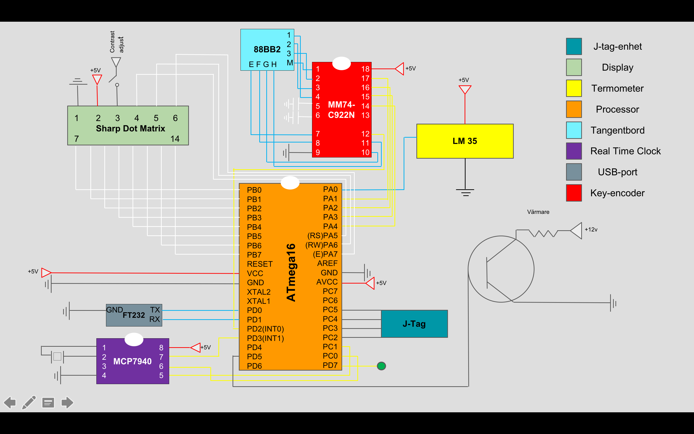

# Sous Vide Project

This Repository cotains the project "Sous Vide Destruktus" made for EITF11 at **Lund University** (Faculty of Engineering) by me (Wilhelm Bolin), Hugo Tedroff and Nils Johansson

During the course we constructed a fully functioning prototype of a Sous Vide *(also known as an immersion circulator)* based on the **AVR Mega16** microprocessor with the code written in C.

Below is a model of the circuit diagram that was used in the final version of the prototype

The project was very successfull and the prototype was fully functioning according to our initial specs and plan. Below is an image of the finalized prototype.  

This project has been migrated to Github at a later time and all code has therefore been put in one document called code.C 
